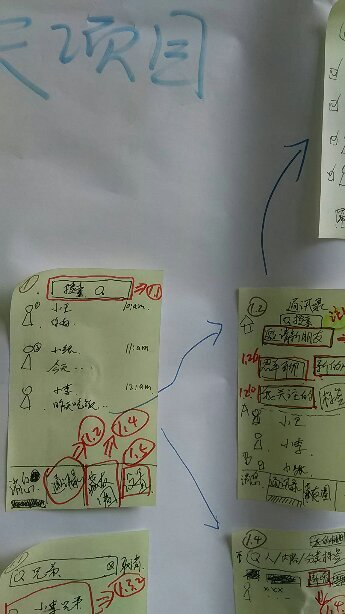
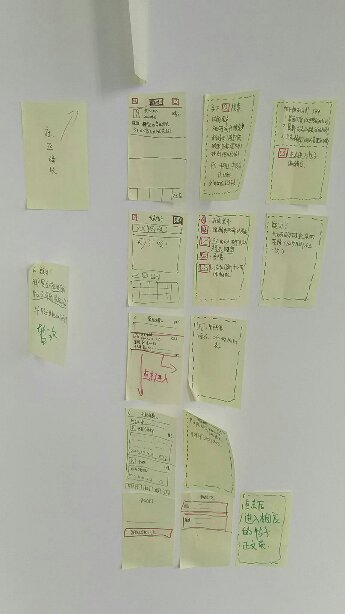
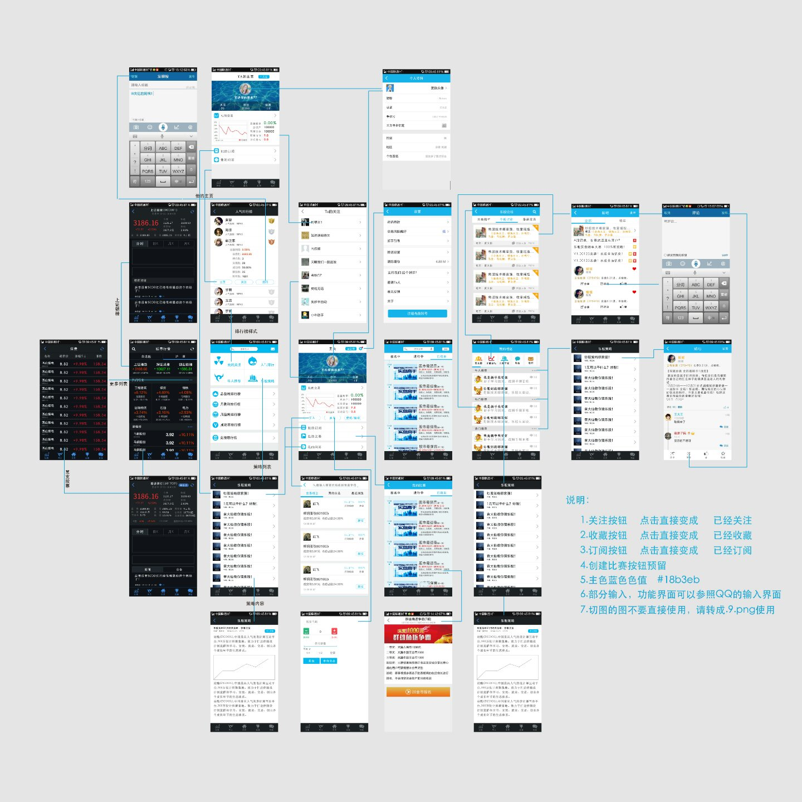
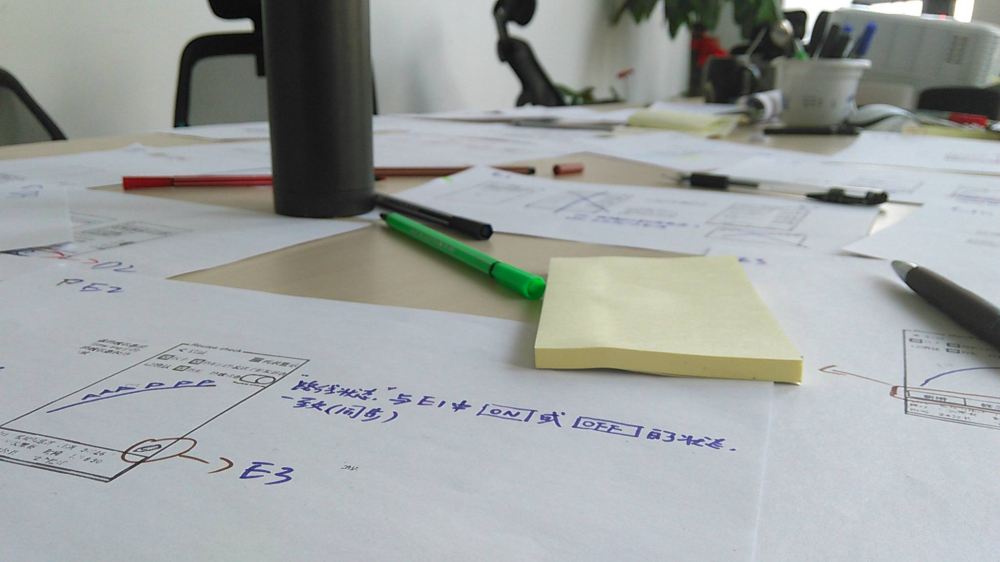
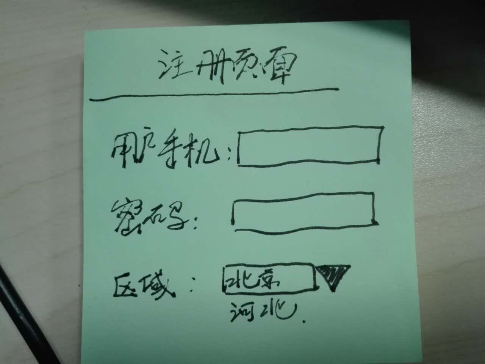
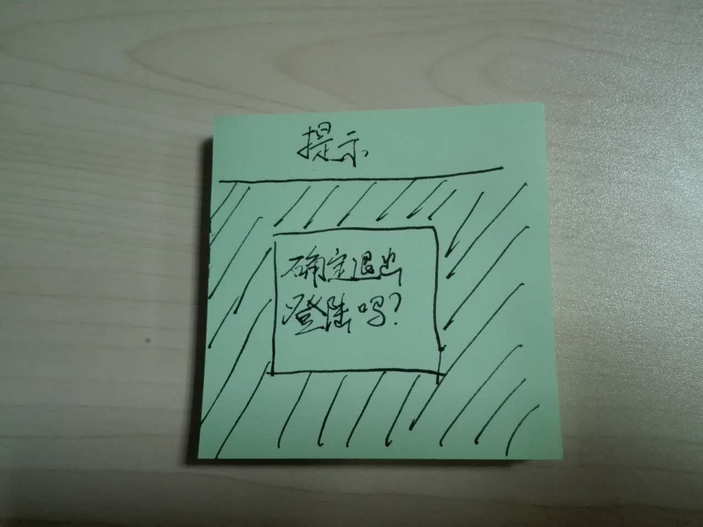
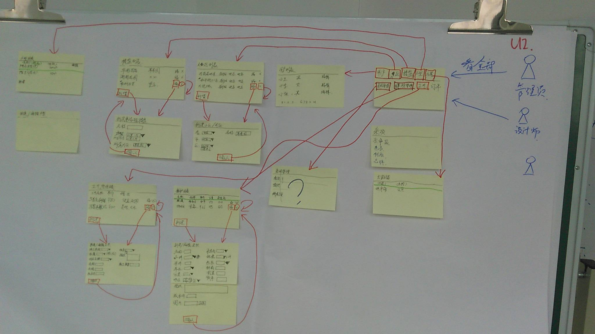
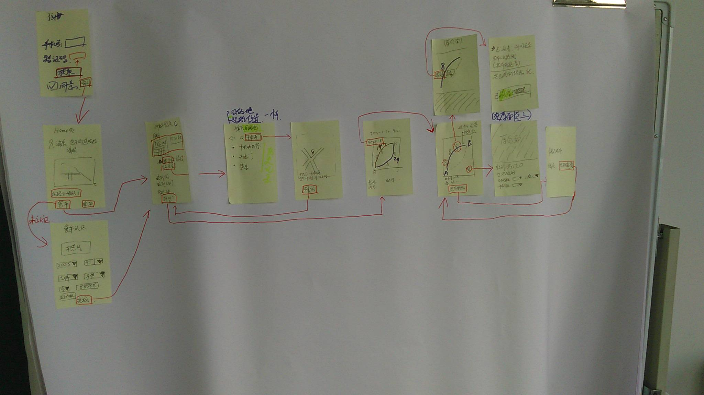
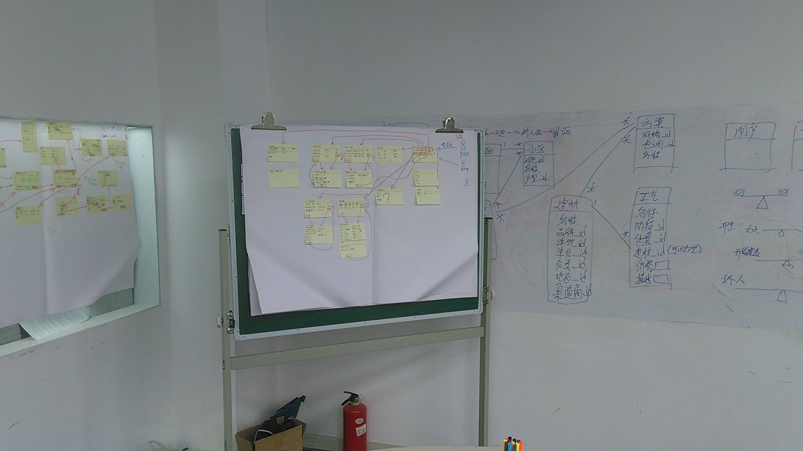

# 所见即所得你的设计

## 概述：

我们团队做产品设计的方式，是先把原型图做出来。

如下面三个图片：

先准备好一张大白纸和黄纸片，然后，快速的手绘项目截图：

有多少个页面，就花多少个，记得标记出每个页面的跳转关系：

经过美工的润色之后，草图就变成这样：

所以，你那边只需要按照这个模式：

1. 整理出所有的功能页面。
2. 标记出页面之间的跳转关系。

即可。 我们就可以针对每个页面估算时间，最后得出累计成本。

下面是具体的说明.

这种建模方法, 在软件咨询公司 Thoughtworks被称为 Inception (盗梦空间).
我给它起的通俗的名字叫黄纸片建模法. 原理是 UI驱动设计.

现今有很多电子化的工具可以用,为什么我们要回归原始呢?

我从业十多年, 各种各样的建模工具都接触过. UML, RationalRose, VisualView, 在线设计软件等等. 不建议使用.

因为电子化办公有很多缺点:

1. 效率低下.
2. 屏幕太小, 无法让人快速理解
3. 越是精心制作的内容, 作者就越不愿意修改. 而我们的目的是拥抱变化. 所以, 有变化我们就改,
拿起笔来就写,不满意就撕掉. 分分钟的事儿.
4. 我们可以把大白纸悬挂在最醒目的角落. 需要的时候可以随时看. 而电子化的东西则不可以.

这套快速建模的方法,基本 2~3个小时就可以把"一句话需求" 转化为具体的产品.然后借助一些工具
(例如  墨刀)  来定型. 直接去讲故事.

1. 准备一张大白纸.   胶水. 黄色便签纸( 需要长条形 )

大白纸: 所有的线和字都写在上面. 白纸能重视的记录所有信息. 不用画板的原因是画板一擦,内容就全没了.
胶水: 为了把便签纸贴牢. 我们在实际操作中发现 便签纸会扭曲变形,而且沾上去很快就掉下来.
便签纸: 购买黄色的. 视觉效果比其他颜色好很多. 而且记得买 长方形的那种. 横着放就是电脑屏幕,竖着放就是手机屏幕.

2. 准备笔:  黑色细笔, 红色粗笔, 绿色粗笔.
约定:
黑色细笔 用来描绘 页面的基本结构
红色粗笔: 用来标记页面的跳转
绿色粗笔: 用来表示注释

3. 页面的结构:

3.1 每个页面都是这样组成的:     页面名称 + 内容. (见图片)
3.2 使用方框, 表示输入文字
3.3 下拉选择框应该是:  一个黑色的,向下的三角:

下面的例子,具备了: 标题, 输入框, 下拉选择框.

3.4 消息,警告等,应该有阴影:

还有几个例子:

所有可以点击的按钮,都要用红色方框划上,然后标记好它的下一个页面.

4. 大白纸的结构:

原则上, 从上到下, 从左到右:   左上角是一个用户图标,表示操作的开始.

附件是一些例子.

下面是 2015年4月10日,我们做的一个ipad端app的 页面逻辑图. 可以看到红色的清晰的箭头, 也可以看到
绿色的注释,  左上方的 蓝色 用户图标,是app的起点.

下面是另一个系统的跳转逻辑:(类似于滴滴顺风车)

下面是一个更加完整的例子:

左侧是无线端app  , 中间是 PC端管理员后台,  右侧是 服务器的数据库设计.

## 几点注意

- 实际当中,我们发现要让程序员参与进来效果最好.也就是说,谁亲自
动手,谁对整个流程了解的就越深入.
- 一定要用红粗笔来标注页面的跳转. 站在一米外都可以看的很清晰.
- 约定好颜色: 红色表示页面的跳转,绿色表示注释. 不适使用三种以上的颜色.
- 不要连笔字, 字迹要清晰. 因为这是给其他人看的.连笔字会显得效果不好,难于辨认.而且有一种乱乱的
感觉,这是我们最应该避讳的.
- 表意要明确. 内容要是"具体的例子",而不是概括的说明,例如,在注册页面,应该是:

手机: 13522223333
密码: ******

而不是

项目1: xxx
项目2: xxx

- 黄纸片要贴的横平竖直, 例如, 大致都分布在同一横线或者竖线上.
- 只能省略第三方的页面,例如:QQ登录,淘宝支付, 手机拍照等. 否则的话,再简单的页面也不要省略.
例如: 忘记密码等. 页面越齐全,越能准确的估算工作量.
- 标注好页面的入口(例如从登录页面开始)

## 一般分成两端

- 手机app端
- 后台管理员(PC端)

如果是B2C的系统,那么就是:

- 普通用户的app
- 商家的app
- 后台管理员的PC端
- 商家的网站.

## 估算工作量

分成两种:

- 画出的页面的工作量, 这些在上面已经看到了.
- 对于app, 有看不到的工作量,包括:
  - 消息推送
  - 不同机型和屏幕尺寸的适配
